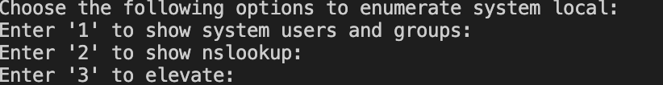

# SysEnum

## A system based enumeration to list system functionalities such as user name and domain, Ns Lookup.

The tools is written using Python3

## Features

- List user name with domain
- Run nslookup for a given domain name
- Elevate current running script to root user

## How to run the tool

Make sure that you have installed python3 and following modules.

- Python can be installed from https://www.python.org/downloads/
- Install the following modules using the command below

```bash
pip3 install prettytable
pip3 install argparse
pip3 install socket
pip3 install sys
pip3 install subprocess
pip3 install shlex
```

Once successful installation of all modules, you will be able to run the application.
Make sure to change the directory where in LEAP.py

```bash
python3 LEAP.py enumerate
```

This will shows the available options as below

Choose the appropriate option to display the results!!!
